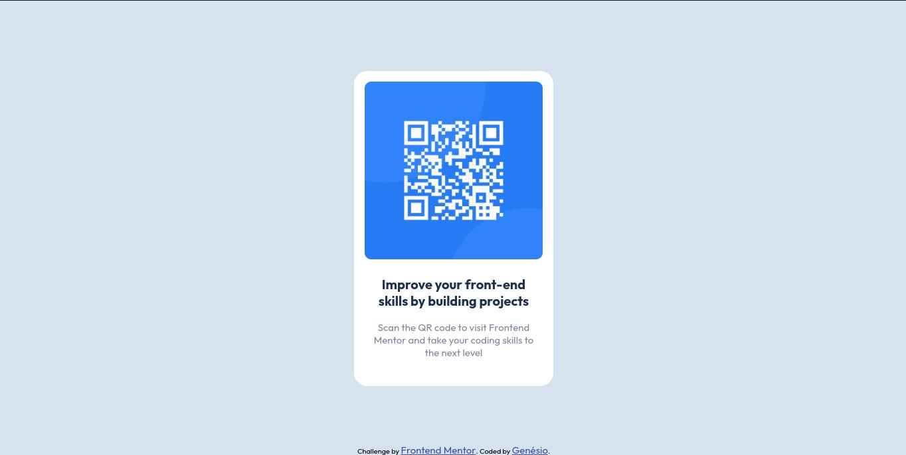

# Frontend Mentor - QR code component solution

This is a solution to the [QR code component challenge on Frontend Mentor](https://www.frontendmentor.io/challenges/qr-code-component-iux_sIO_H). Frontend Mentor challenges help you improve your coding skills by building realistic projects.

## Table of contents

- [Overview](#overview)
  - [Screenshot](#screenshot)
  - [Links](#links)
- [My process](#my-process)
  - [Built with](#built-with)
  - [What I learned](#what-i-learned)
- [Author](#author)

**Note: Delete this note and update the table of contents based on what sections you keep.**

## Overview

### Screenshot

### Links

- Solution URL: [Add solution URL here](https://your-solution-url.com)
- Live Site URL: [Add live site URL here](https://your-live-site-url.com)

## My process

- Create a wrapper to define margin
- Create a div to create card
- Add image and a div to text
- Create one strong and one p tags inside text

### Built with

- Semantic HTML5 markup
- CSS custom properties
- Flexbox
- Mobile-first workflow

### What I learned

I already knew the properties and tags I used, but I thought it was a great exercise to keep the base.

## Author

- Website - [Portfolio](https://genesonio.vercel.app)
- Frontend Mentor - [@genesonio](https://www.frontendmentor.io/profile/genesonio)
- LinkedIn - [Genésio S. Pacheco](https://www.linkedin.com/in/genesonio/)
